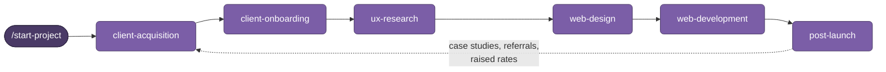

<div align="center">

# 🧭 Freelance Web Design Pipeline

**A six-stage [Claude Skills](https://docs.claude.com) system that takes a freelance web design project from cold lead → delivered site → recurring revenue — with context carried automatically between every stage.**


</div>

---

## Table of Contents

- [What This Is](#what-this-is)
- [Why It Exists](#why-it-exists)
- [How It Works](#how-it-works)
- [The Six Skills](#the-six-skills)
- [Architecture: the `project.md` handoff](#architecture-the-projectmd-handoff)
- [The Impeccable Command Layer](#the-impeccable-command-layer)
- [Installation](#installation)
- [Personalize It](#personalize-it)
- [Usage](#usage)
- [File Structure](#file-structure)
- [Roadmap](#roadmap)
- [How This Was Built](#how-this-was-built)
- [References & Inspiration](#references--inspiration)
- [Author's Note](#authors-note)
- [Contributing](#contributing)
- [License](#license)

---

## What This Is

This repository is a **pipeline of six Claude Skills** that together run an entire solo freelance web design business. Each skill owns one stage of the client lifecycle. They hand off to each other through a single shared file (`project.md`), so a project's context — who the client is, what was agreed, the research, the design decisions, the build — flows from the first cold email all the way to the final invoice without ever being re-explained.

It is built to run in **[Claude Code](https://docs.claude.com)** (where the skills read and write files directly) and in the **Claude.ai / desktop app** (where you paste the handoff file between stages).

## Why It Exists

Most "AI for freelancers" tooling is a pile of disconnected prompts. The problem with disconnected prompts is that every one starts from zero — you re-explain the client, the scope, and the decisions every single time. This pipeline solves that with a stateful handoff file and clear stage boundaries, so the work compounds instead of resetting. It's opinionated, scoped to **local small-business web design**, and tuned for a one-person shop rather than an agency.

## How It Works



1. **Each skill activates only for its stage** and declares a "when NOT to use" boundary, so the right skill fires and the others stay out of the way.
2. **State is passed in `project.md`** — every skill reads it on start and appends its block on finish.
3. **The loop closes** — `post-launch` produces the case studies, referrals, and social proof that feed straight back into `client-acquisition`.

## The Six Skills

> ⚡ **Start here:** run **`start-project`** (say *"start a new project"* or `/start-project`). It's the one command that creates the `project.md` handoff file and routes you to the right stage — use it instead of waiting for a stage skill to self-trigger. The six stages it orchestrates:

| # | Skill | Stage | What it does | Key references |
|---|-------|-------|--------------|----------------|
| 1 | **client-acquisition** | Find work | Prospect research, cold outreach (5 channels), lead qualification, objection handling | `outreach-scripts.md`, `objection-playbook.md` |
| 2 | **client-onboarding** | Win work | Discovery call, questionnaire, proposal, pricing, your contract **and** reviewing a client's contract | `questionnaires.md`, `contract-clauses.md`, `reviewing-a-client-contract.md`, `red-flags.md` |
| 3 | **ux-research** | Decide what to build | Proto-personas, anti-personas, JTBD, competitive analysis, research → design requirements | `research-generative.md`, `research-evaluative.md` |
| 4 | **web-design** | Design it | Double-Diamond flow, wireframes, 3 visual directions, design system, accessibility, Aesthetic Execution, Audit Mode | `design-system.md`, `accessibility.md`, `prompt-templates.md`, `anti-patterns.md`, `project-types.md`, `ux-process.md` |
| 5 | **web-development** | Build & ship it | Stack decision, production code, SEO **+ AEO**, accessibility, performance, security, favicon/social assets, handoff | `stack-and-delivery.md`, `seo-basics.md`, `accessibility.md` |
| 6 | **post-launch** | Get paid & grow | Final invoice, collections, maintenance plans & reports, recurring revenue, referrals, case studies, expense/tax tracking | `invoicing-and-payment.md`, `recurring-revenue.md`, `portfolio-and-growth.md` |

Every skill is a folder with a `SKILL.md` (the instructions + metadata) and a `references/` directory of deep, on-demand reference docs — following Anthropic's **progressive disclosure** model (lightweight metadata up front, full detail loaded only when needed).

## Architecture: the `project.md` handoff

A single Markdown file per client carries the whole project. Each stage appends one block:

```
ACQUISITION → ONBOARDING → RESEARCH → DESIGN → DEVELOPMENT → BUSINESS
```

The canonical, copy-paste template lives at **[`docs/project-md-template.md`](docs/project-md-template.md)**. Real client files stay out of version control (see [`.gitignore`](.gitignore)) — only the template belongs in the repo.

## The Impeccable Command Layer

The design and build stages share a set of `/slash` micro-commands (e.g. `/audit`, `/critique`, `/harden`, `/optimize`, `/polish`) used as shorthand for common design and code operations. The full set is defined in `skills/web-design/SKILL.md`; `web-development` re-uses the nine that apply to the build phase. The command vocabulary is based on the [Impeccable](https://impeccable.style) design language.

## Installation

**Claude Code (recommended):**
```bash
# clone, then symlink or copy the skills into your Claude Code skills directory
git clone https://github.com/<your-username>/freelance-web-design-pipeline.git
cp -r freelance-web-design-pipeline/skills/* ~/.claude/skills/
```

**Claude.ai / desktop app:** upload or paste a skill's `SKILL.md` (and the relevant reference file) at the start of a stage. Paste `project.md` in and out between stages to carry context.

> Skill installation paths and mechanics evolve — check the current [Claude docs](https://docs.claude.com) and [Anthropic's skills repo](https://github.com/anthropics/skills) for the latest.

## Personalize It

The skills are written generically with fill-in placeholders so anyone can use them. Before (or as) you run a project, replace these with your own details — a quick find-and-replace across `skills/` does it, or just let Claude fill them as it goes:

| Placeholder | Replace with |
|---|---|
| `[Your Name]` | your name (used in outreach, proposals, invoices, sign-offs) |
| `[your email]` / `[your phone]` | your contact details and payment handles |
| `[your-portfolio.com]` | your portfolio or business domain |
| `[your-username]` | your GitHub username |
| `[your city]` / `[your region]` / `[Your City, ST]` / `[a nearby city]` / `[a higher-cost metro]` | your location and service area |
| `~/Desktop/WebsiteProjects/` | wherever you keep client work |

A few things are intentionally **left for you to confirm locally**: legal specifics (small-claims limits, contract enforceability, tax rules) vary by jurisdiction — the skills flag these as "check your local rules" rather than assert a number, so verify them for where you operate. Illustrative examples in the reference docs (e.g. a sample "Rodriguez Plumbing" in a city) are just teaching examples — leave them or swap in your own.

## Usage

1. **Start a project.** Run `start-project` (or just say *"start a new project"*). It creates `project.md` from the template and routes you to the right stage.
2. **Move down the pipeline.** Tell Claude there's an active project; each stage reads the file, does its work, and appends its block.
3. **Hand off.** In Claude Code the file is written directly; in the app you paste it in and out.
4. **Close the loop.** `post-launch` closes out the money and produces case studies that feed back into acquisition.

Each skill only activates when you say there's an active project, so they won't fire on unrelated requests.

> 📄 **See a complete project:** [`examples/example-project-reyes-landscaping.md`](examples/example-project-reyes-landscaping.md) is a fictional client filled in from first contact to published case study — every `project.md` field populated, with the artifacts each stage produces (code shown as placeholders).

## File Structure

```
freelance-web-design-pipeline/
├── README.md
├── LICENSE
├── CONTRIBUTING.md
├── .gitignore
├── docs/
│   ├── project-md-template.md        # canonical handoff template
│   └── CLAUDE-CODE-NEXT-STEPS.md      # roadmap + repo setup + eval plan
├── examples/
│   └── example-project-reyes-landscaping.md   # a full project, filled start to finish
└── skills/
    ├── start-project/                  # ⚡ pipeline entry point — one command to start
    │   └── SKILL.md
    ├── client-acquisition/
    │   ├── SKILL.md
    │   └── references/
    │       ├── outreach-scripts.md
    │       └── objection-playbook.md
    ├── client-onboarding/
    │   ├── SKILL.md
    │   └── references/
    │       ├── questionnaires.md
    │       ├── contract-clauses.md
    │       ├── reviewing-a-client-contract.md
    │       └── red-flags.md
    ├── ux-research/
    │   ├── SKILL.md
    │   └── references/
    │       ├── research-generative.md
    │       └── research-evaluative.md
    ├── web-design/
    │   ├── SKILL.md
    │   └── references/
    │       ├── design-system.md
    │       ├── accessibility.md
    │       ├── prompt-templates.md
    │       ├── anti-patterns.md
    │       ├── project-types.md
    │       └── ux-process.md
    ├── web-development/
    │   ├── SKILL.md
    │   └── references/
    │       ├── stack-and-delivery.md
    │       ├── seo-basics.md
    │       └── accessibility.md
    └── post-launch/
        ├── SKILL.md
        └── references/
            ├── invoicing-and-payment.md
            ├── recurring-revenue.md
            └── portfolio-and-growth.md
```

## Roadmap

- [ ] **Evaluation layer** — test prompts per skill to verify triggering and output quality; automated description optimization via the `skill-creator` eval loop / `task-observer`.
- [ ] **Wire the canonical `project.md` template** into each skill's session-start ("create it using the canonical template" → point at `docs/project-md-template.md`).
- [ ] **State-aware kickoff** — let `client-acquisition` detect where a returning lead is and route to the right stage.
- [ ] **Deterministic scripts** — optional Python helpers for PDF proposal/report generation and persona-from-data.
- [ ] **Keep SEO/AEO fresh** — answer-engine optimization moves fast; revisit `seo-basics.md` periodically.

## How This Was Built

This pipeline started as a from-scratch project and was then deliberately improved by studying the wider Claude Skills ecosystem — borrowing patterns and filling gaps, stage by stage, rather than reinventing. A retired all-in-one prototype (`senior-web-designer`) was mined for its worthwhile material (an accessibility reference and a prompt-template library) and then deprecated in favor of this modular pipeline. Every borrowed idea was adapted to a solo, local-small-business context rather than copied wholesale; enterprise-weight tooling (full MEDDIC, bulk-outbound automation, Python lead-scorers) was intentionally left out.

## References & Inspiration

The patterns below informed specific stages of this pipeline. They are credited as **inspiration and reference** — the implementations here are original and adapted to this use case.

**Official Anthropic**
- [`anthropics/skills`](https://github.com/anthropics/skills) — official skills, the `template`/`spec`, and skills like `frontend-design`, `webapp-testing`, `web-asset-generator`, `skill-creator`, and the document skills (`docx`/`pdf`/`pptx`/`xlsx`)
- [Claude docs](https://docs.claude.com) · ["Skills explained" (Anthropic blog)](https://claude.com/blog/skills-explained) · the [Agent Skills](https://agentskills.io) open standard

**Community hubs & awesome-lists**
- [`travisvn/awesome-claude-skills`](https://github.com/travisvn/awesome-claude-skills)
- [`hesreallyhim/awesome-claude-code`](https://github.com/hesreallyhim/awesome-claude-code)
- [`VoltAgent/awesome-agent-skills`](https://github.com/VoltAgent) · [`ComposioHQ/awesome-claude-skills`](https://github.com/ComposioHQ) · [`BehiSecc/awesome-claude-skills`](https://github.com/BehiSecc)

**Large skill libraries**
- [`alirezarezvani/claude-skills`](https://github.com/alirezarezvani) · [`OneWave-AI/claude-skills`](https://github.com/OneWave-AI) · [`Owl-Listener/designer-skills`](https://github.com/Owl-Listener) · [`obra/superpowers`](https://github.com/obra/superpowers)

**Stage-specific inspiration**
- *Acquisition* — `zubair-trabzada/ai-sales-team-claude` (BANT/MEDDIC qualification, outreach + objection templates), `growthenginenowoslawski/coldoutboundskills` (state-aware kickoff/handoff), `BrianRWagner/ai-marketing-claude-code-skills` (wins → case studies)
- *Onboarding* — `borghei/Claude-Skills` (contract & proposal writer), `zubair-trabzada/ai-legal-claude` (contract review from the freelancer's side), `peterbamuhigire/proposal-skills` (anti-"AI-voice" word list)
- *UX research* — `alirezarezvani` ux-researcher/designer (persona-from-data), `Owl-Listener/designer-skills` (research command flow), `szilu/ux-designer-skill` (deep-reference structure), `design-personas` (anti-persona pattern)
- *Design & build* — the [`shadcn/ui`](https://ui.shadcn.com) skill, OWASP-oriented security skills, and [Trail of Bits](https://github.com/trailofbits) security guidance
- *Post-launch* — `invoice-organizer`, the [findskills.co](https://findskills.co) freelancer set, and `solo-skills` ("when NOT to use" convention)

**Answer Engine Optimization (AEO) research** — [Frase](https://www.frase.io), [AirOps "State of AI Search"](https://www.airops.com), [HubSpot](https://blog.hubspot.com), [CXL](https://cxl.com), [evergreen.media](https://www.evergreen.media), and John Paul Hernandez's AEO playbook informed the AEO section of `seo-basics.md`.

**Design system** — [Impeccable](https://impeccable.style) (the `/slash` command vocabulary).

## Author's Note

Beyond the community research above, the **domain content of this pipeline draws on my own original material** — notes, frameworks, and hard-won lessons from:

- a **B.A. in Product Design (UC Davis)** — the design process, IA, and research methods,
- the **Google UX Design Certificate** — usability and research practice,
- and real **freelance + retail-technology experience** — the pricing, contracts, client-handling, and business operations.

The UX process, design decisions, pricing logic, objection handling, and business playbooks here reflect my own training and field notes, not just generated text. The community skills above sharpened and filled gaps in that foundation; they didn't replace it.

## Contributing

This is primarily a personal system, but improvements are welcome. See [`CONTRIBUTING.md`](CONTRIBUTING.md). Issues and PRs that adapt a stage, tighten a skill's triggering, or add a well-scoped reference are especially appreciated. Please don't commit real client data.

## License

[MIT](LICENSE) © Dereck Villagrana

---

<div align="center">
<sub>Built with Claude · Designed for solo freelancers · Made in the Central Valley, CA</sub>
</div>
